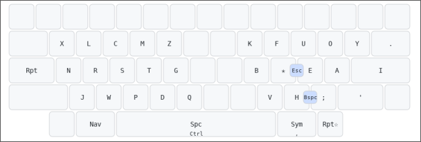

# Psilocybin

Psilocybin is a magic layout designed for HHKB layout, with slides and magic key in mind.

## Magics 🪄
⚝ is the `magic` key(home row right index)\
⬡ is the `right repeat` key(right thumb)\
⬢ is the `left repeat` key(left outer pinky)\
⎵ is white space

| Combo    | Output      |
| ------   | --------    |
| `m⚝`     | `mp`        |
| `y⚝`     | `y.`        |
| `e⚝`     | `eu`        |
| `p⚝`     | `pt`        |
| `p⬢`     | `pm`        |
| `r⚝`     | `rl`        |
| `l⚝`     | `lr`        |
| `w⚝`     | `ws`        |
| `s⚝`     | `sw`        |
| `i⚝`     | `ion`       |
| `i⬡`     | `ing`       |
| `ad⚝`    | `adm`       |
| `d⚝`     | `dg`        |
| `v⚝`     | `ver`       |
| `igh⚝`   | `ighbo`     |
| `t⚝`     | `tch`       |
| `t⬢`     | `tp`        |
| `⎵⚝`     | `th`        |
| `⎵⚝⎵`    | `the`       |
| `⎵⚝⬡`    | `them`      |
| `⎵⚝y⬡`   | `they'`     |
| `⎵⚝y⬡r`  | `they're`   |
| `⎵⚝y⬡v`  | `they've`   |
| `⎵⚝y⬡l`  | `they'll`   |
| `⎵⚝r⎵`   | `their`     |
| `⎵⚝re`   | `there`     |
| `⎵⚝n`    | `then`      |
| `⎵⚝s`    | `these`     |
| `⎵⚝o`    | `tho`       |
| `⎵⚝os`   | `those`     |
| `⎵⚝oh`   | `though`    |
| `scrip⚝` | `script`    |
| `ip⚝`    | `ipment`    |
| `lop⚝`   | `lopment`   |
| `oop⚝`   | `oopment`   |
| `rt⚝`    | `rtment`    |
| `nt⚝`    | `ntment`    |
| `st⚝`    | `stment`    |
| `ft⚝`    | `ftment`    |
| `eat⚝`   | `eatment`   |
| `uit⚝`   | `uitment`   |
| `mit⚝`   | `mitment`   |
| `i⬡`     | `ing`       |
| `y⬡`     | `ying`      |
| `v⬡ `    | `ving`      |
| `k⬢ `    | `king`      |
| `ng⬡`    | `nging`     |
| `nd⬡`    | `nding`     |
| `ow⬡`    | `owing`     |
| `raw⬡`   | `rawing`    |
| `row⬡`   | `rowing`    |
| `ew⬡ `   | `ewing`     |
| `w⬢`     | `was`       |
| `h⬡`     | `hav`       |

## Fingering and slides

| Keys     | Fingering                |
| ------   | --------                 |
| `sc/cs`  | `index-middle`           |
| `tm/mt`  | `index-middle`           |
| `gt`     | `index-middle`           |
| `pd`     | `middle-index`           |
| `dt`     | `index-middle`           |
| `bv`     | `maybe slide?`           |
| `'a/a'`  | `pinky-ring`             |
| `ue`     | `slide`                  |
| `oa`     | `slide`                  |
| `y'`     | `maybe pinky thumb, idk` |
| `i'`     | `pinky ring`             |
